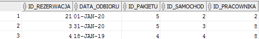
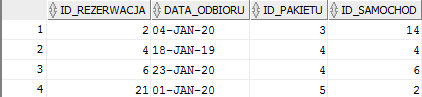
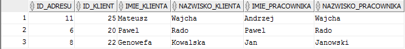
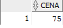
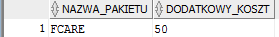
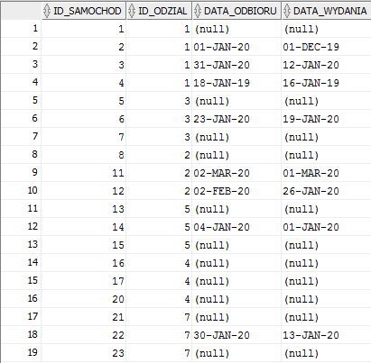
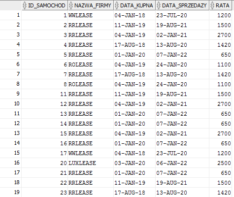
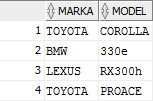
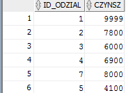
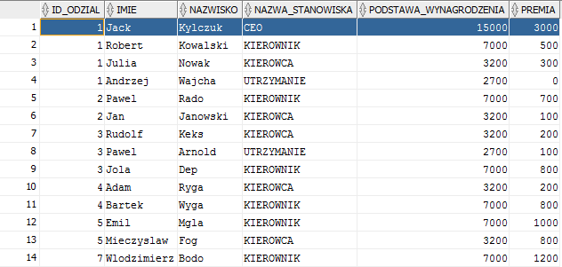

Data utworzenia: 26.01.2020

Baza danych przechowuje dane potrzebne do prowadzenia wypożyczalni samochodów. Zawiera takie tabele jak:
SAMOCHOD_SEGMENT – tabela opisująca segment samochodu, na podstawie którego możemy dowiedzieć się jaka jest cana za dobe danego samochodu która jest uzależniona od segmentu. W tabeli segment mamy też informację jaka jest promocja na dany segment. Klucz główny id_segment

MARKAMODEL – tabela przechowująca marke i model oraz klucz obcy id_segment by przypisać dany model do segmentu. zakładam, że marka oraz model nie identyfikują jednoznacznie każdego segmentu (Przykład: Seat toledo gdzie pierwsza generacja była segmentem b następnie „urosła” do segmentu van) Klucz główny id_marka_model

SAMOCHOD – przechowuje informacje na temat danego egzemplarza samochodu, posiada informacje takie jakie, id_marka_model, lokalizacja, nr_rejestracyjny, do jakiego odzialu jest przypisany or Id leasingu. Klucz główny: id_samochod

LEASING – wypożczyalnia nie ma swoich samochodów jedynie je leasinguje. W tabeli leasing zamieszczone są informacje od jakiej firmy wypożyczalnia leasinguje samochody, jaka jest miesięczna rata oraz ramy czasowe w jakich wypożyczalnia może korzystać z samochodu: Klucz główny id_leasingu

ODZIAL – przechowuje informacje na temat oddziału takie jak: czynsz miesięczny, godziny otwarcia i zamknięcia, tel_głowny który jest kluczem obcym do tabeli przechowującej informacje kontakowe do odziału, id_adresu odzialu, które opisuje dane na temat adresu każdego z odziaów. klucz główny Id_odzialu

ADRES – przechowuje dane na temat adresu pracowników oraz klienta jest możliwe, że wielu klientów i pracowników może posiadać ten sam adres

DANE_KONTAKTOWE – przechowuje informacje na temat danych kotaktowych, jedna osoba musi mieć jedne dane kontakowe klucz główny numer telefonu

STANOWISKO – dane na temat stanowiska czyli nazwa oraz podstawa wynagrodzenia kilka tych samuch stanowisk mogło by mieć to samo wynagrodzenie więc kluczem głównym id_stanowiska

PRACOWNIK – dane personalne na temat pracownika wraz z odniesieniami do oinnych tabel poprzez klucze obce numer telefony, id adresu, id stanowiska, id odzial, w którym pracuje oraz dodatkowa premia kluczem głównym jest id_pracownika

KLIENT – dane personalne na temat klienta oraz jeżeli jest klientem firmowym dodatkowo o jego firmie, klucz główny id klienta

PAKIETY_DODATKOWE - id_ pakietu jako klucz główny, nazwa pakietu oraz dodatkowy koszt jaki pokrywa klient podczas rezerwacji jeżeli się zdecyduje na dany rodzaj pakietu

REZERWACJA – przechowuje dane na temat konkretnej rezerwacji takie jak: data_wydania ora odbioru, lokalizacja miejsca wydania oraz odbioru oraz klucze obce do innych tabel przechowujących dane na temat rezerwacji. Jedna rezerwacja może mieć wyłącznie jeden samochód, może go obsługiwać tylko jeden pracownik, można wypożyczyć go jednemu klientowi klucz główny id_rezerwacja
Do każdej tabeli oprócz dotyczących danych kontakowych do każdego klucza głównego jest dołączony trigger, który automatycznie zwiększa indeksy przy wstawianiu danych.

Schemat:


TESTY:
zwraca informacje na temat rezerwacji z oddziału nr 1, takie jak id_rezerwacji, data odbioru, id_pakietu, id_samochodu, id pracownika

```
SELECT id_rezerwacja, 
       rezerwacja.data_odbioru, 
       rezerwacja.id_pakietu, 
       rezerwacja.id_samochod, 
       pracownicy.id_pracownika 
FROM   rezerwacja 
       inner join pracownicy 
               ON rezerwacja.id_pracownika = pracownicy.id_pracownika 
WHERE  pracownicy.id_odzial = 1 
```



Rezerwacje, których data obioru jak i zwrotu jest mniejsza od obecnej:

```
SELECT id_rezerwacja, 
       rezerwacja.data_odbioru, 
       rezerwacja.id_pakietu, 
       rezerwacja.id_samochod 
FROM   rezerwacja 
WHERE  data_odbioru < (SELECT To_char(SYSDATE, 'DD-MON-YYYY') 
                       FROM   dual) 
       AND data_wydania < (SELECT To_char(SYSDATE, 'DD-MON-YYYY') 
                           FROM   dual); 
```


Klienci oraz pracownicy o tym samym adresie

```
SELECT klient.id_adresu, 
       klient.id_klient, 
       klient.imie         imie_klienta, 
       klient.nazwisko     nazwisko_klienta, 
       pracownicy.imie     imie_pracownika, 
       pracownicy.nazwisko nazwisko_pracownika 
FROM   klient 
       inner join pracownicy 
               ON pracownicy.id_adresu = klient.id_adresu;
```


wyświetla cene za dzień dla segmentu o numerze rezerwacji id = 2:

```
SELECT cena 
FROM   samochod_segment 
WHERE  id_segment = (SELECT id_segment 
                     FROM   markamodel 
                     WHERE  id_marka_model = (SELECT id_marka_model 
                                              FROM   samochod 
                                              WHERE 
                            id_samochod = (SELECT id_samochod 
                                           FROM   rezerwacja 
                                           WHERE  id_rezerwacja = 2))); 
```


Wyświetla nazwe oraz dodatkowy koszt związany wykupionym dodatkowym pakietem

```
SELECT nazwa_pakietu, 
       dodatkowy_koszt 
FROM   pakiety_dodatkowe 
WHERE  id_pakietu = (SELECT id_pakietu 
                     FROM   rezerwacja 
                     WHERE  rezerwacja.id_rezerwacja = 3); 
```


Samochody wraz z odzialami oraz dostepnoscia na podstawie rezerwacji
```
SELECT samochod.id_samochod, 
       samochod.id_odzial, 
       rezerwacja.data_odbioru, 
       rezerwacja.data_wydania 
FROM   samochod 
       left join rezerwacja 
              ON samochod.id_samochod = rezerwacja.id_samochod 
ORDER  BY samochod.id_samochod; 
```


id samochodow wraz z nazwa firmy leasingującej oraz data kupna data sprzedazy oraz rata jaką wypożyczalnia płaci za samochód
```
SELECT samochod.id_samochod, 
       leasing.nazwa_firmy, 
       leasing.data_kupna, 
       leasing.data_sprzedazy, 
       leasing.rata 
FROM   samochod 
       inner join leasing 
               ON samochod.id_leasing = leasing.id_leasing 
ORDER  BY samochod.id_samochod; 
```


Samochody z danego odziału wraz z marką i modelem
```
SELECT markamodel.marka, 
       markamodel.model 
FROM   markamodel 
       inner join (SELECT id_marka_model 
                   FROM   samochod 
                   WHERE  id_odzial = 1) zz 
               ON markamodel.id_marka_model = zz.id_marka_model; 
```


Czynsze dla każdego oddziału
```
SELECT id_odzial, 
       czynsz 
FROM   oddzial; 
```


Wszyscy pracownicy wraz z dzialem i wynagrodzeniem

```
SELECT pracownicy.id_odzial, 
       pracownicy.imie, 
       pracownicy.nazwisko, 
       stanowisko.nazwa_stanowiska, 
       stanowisko.podstawa_wynagrodzenia, 
       pracownicy.premia 
FROM   pracownicy 
       inner join stanowisko 
               ON stanowisko.id_stanowiska = pracownicy.id_stanowiska 
ORDER  BY pracownicy.id_odzial; 
```



Utworzono przy pomocy Oracle Designer
