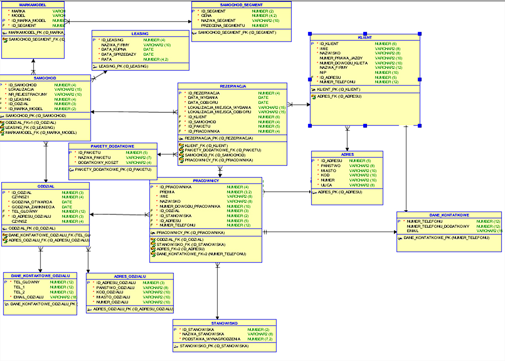

Data utworzenia: 26.01.2020

Baza danych przechowuje dane potrzebne do prowadzenia wypożyczalni samochodów. Zawiera takie tabele jak:
SAMOCHOD_SEGMENT – tabela opisująca segment samochodu, na podstawie którego możemy dowiedzieć się jaka jest cana za dobe danego samochodu która jest uzależniona od segmentu. W tabeli segment mamy też informację jaka jest promocja na dany segment. Klucz główny id_segment

MARKAMODEL – tabela przechowująca marke i model oraz klucz obcy id_segment by przypisać dany model do segmentu. zakładam, że marka oraz model nie identyfikują jednoznacznie każdego segmentu (Przykład: Seat toledo gdzie pierwsza generacja była segmentem b następnie „urosła” do segmentu van) Klucz główny id_marka_model

SAMOCHOD – przechowuje informacje na temat danego egzemplarza samochodu, posiada informacje takie jakie, id_marka_model, lokalizacja, nr_rejestracyjny, do jakiego odzialu jest przypisany or Id leasingu. Klucz główny: id_samochod

LEASING – wypożczyalnia nie ma swoich samochodów jedynie je leasinguje. W tabeli leasing zamieszczone są informacje od jakiej firmy wypożyczalnia leasinguje samochody, jaka jest miesięczna rata oraz ramy czasowe w jakich wypożyczalnia może korzystać z samochodu: Klucz główny id_leasingu

ODZIAL – przechowuje informacje na temat oddziału takie jak: czynsz miesięczny, godziny otwarcia i zamknięcia, tel_głowny który jest kluczem obcym do tabeli przechowującej informacje kontakowe do odziału, id_adresu odzialu, które opisuje dane na temat adresu każdego z odziaów. klucz główny Id_odzialu

ADRES – przechowuje dane na temat adresu pracowników oraz klienta jest możliwe, że wielu klientów i pracowników może posiadać ten sam adres

DANE_KONTAKTOWE – przechowuje informacje na temat danych kotaktowych, jedna osoba musi mieć jedne dane kontakowe klucz główny numer telefonu

STANOWISKO – dane na temat stanowiska czyli nazwa oraz podstawa wynagrodzenia kilka tych samuch stanowisk mogło by mieć to samo wynagrodzenie więc kluczem głównym id_stanowiska

PRACOWNIK – dane personalne na temat pracownika wraz z odniesieniami do oinnych tabel poprzez klucze obce numer telefony, id adresu, id stanowiska, id odzial, w którym pracuje oraz dodatkowa premia kluczem głównym jest id_pracownika

KLIENT – dane personalne na temat klienta oraz jeżeli jest klientem firmowym dodatkowo o jego firmie, klucz główny id klienta

PAKIETY_DODATKOWE - id_ pakietu jako klucz główny, nazwa pakietu oraz dodatkowy koszt jaki pokrywa klient podczas rezerwacji jeżeli się zdecyduje na dany rodzaj pakietu

REZERWACJA – przechowuje dane na temat konkretnej rezerwacji takie jak: data_wydania ora odbioru, lokalizacja miejsca wydania oraz odbioru oraz klucze obce do innych tabel przechowujących dane na temat rezerwacji. Jedna rezerwacja może mieć wyłącznie jeden samochód, może go obsługiwać tylko jeden pracownik, można wypożyczyć go jednemu klientowi klucz główny id_rezerwacja
Do każdej tabeli oprócz dotyczących danych kontakowych do każdego klucza głównego jest dołączony trigger, który automatycznie zwiększa indeksy przy wstawianiu danych.

Schemat:

Utworzono przy pomocy Oracle Designer
